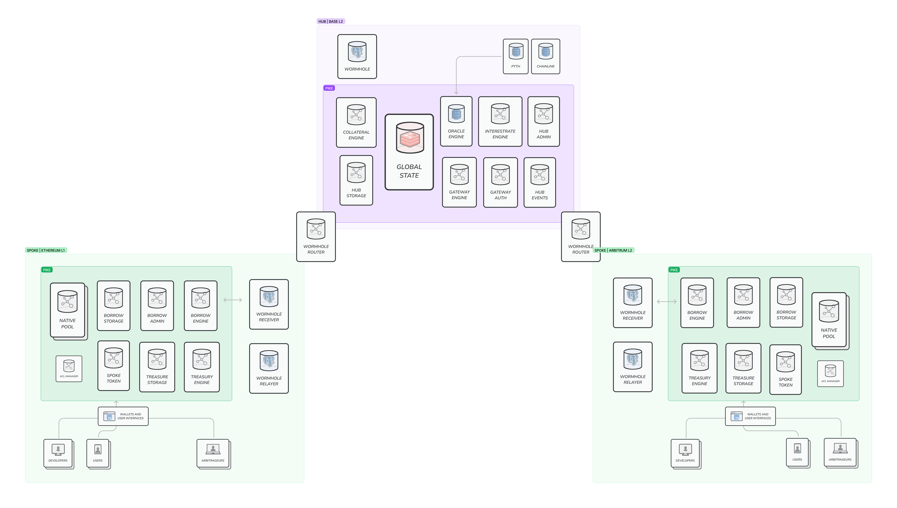
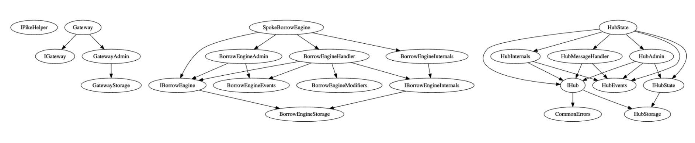
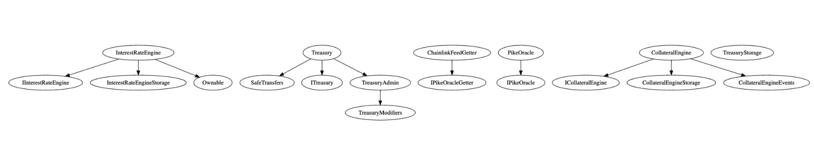

# Pike protocol

The protocol allows users to deposit native assets on any supported chain and borrow native assets
on any other chain, while being backed by their entire multi-chain portfolio.

### Scope

Full repository except for the following paths:

- `src/contracts/gateway/routing/`
- `src/contracts/gateway/interfaces/IWormhole.sol`
- `src/contracts/gateway/interfaces/IWormholeRelayer.sol`
- `src/contracts/gateway/interfaces/IWormholeReceiver.sol`
- `src/contracts/hub/oracles/`
- `src/contracts/util/ABDKMathQuad.sol`

## System overview

<div style="width:100%">
  
</div>
<div style="width:100%;margin:0.5rem 0">
  
</div>
<div style="width:100%">
  
</div>

<br>

**The Hub**

Hub is the chain which controls the universal liquidity. It performs the global accounting,
maintains all the information from Spokes, approves or declines users' actions.

**The Spoke**

Spoke is the chain where users interact with the protocol (except for liquidations). Actions taken
on Spokes are forwarded to the Hub for getting approvals.

**Generic messaging**

Pike employs the Wormhole protocol for generic messages passing.

## Contracts

**HubState**

HubState is the central point of the Pike protocol and maintains the aggregated state from all
Spokes. Also, HubState performs all the necessary calculations to validate key users actions like
depositing, borrowing, repaying and withdrawing.

Hubstate inherits from multiple auxiliary contracts related to the Hub state.

The only publicly accessible functions are designed for liquidations.

**Gateway**

The contract is deployed on each Spoke and serves as a communication means between the Pike
contracts and Wormhole message-passing solution. Wormhole triggers actions with payload on Gateway
which delegates these actions to their relevant destinations.

Gateway holds a mapping of authorized contracts and supported chains. Only these contracts can call
functions that forward messages to relevant chains.

**BorrowEngine**

BorrowEngine contract is deployed on each Spoke and used for the management of loans taken on that
Spoke. Contains logic which allows users to perform borrowings and repayments.

**Treasury**

Treasury contract holds pooled reserve assets and is controlled only by the Hub.

**CollateralEngine**

The contract calculates how much user can borrow against his deposits.

**InterestRateEngine**

The contract is used for algorithmically increasing or decreasing interest rates for various
supported assets based on multiple internal and external factors.

**OracleEngine**

The contract is responsible for retrieving actual price feeds from various sources.

## Setup

1. Install Foundry by following the instructions from
   [their repository](https://github.com/foundry-rs/foundry#installation).
2. Copy the `.env.example` file to `.env` and fill in the variables
3. Install the dependencies by running : `yarn install && forge install`

## Build

```bash
yarn build
```

## Running tests

- Unit tests: WIP
- E2E tests: requires Wormhole generic relayers

## Deploy & verify

### Setup

Configure the `.env` variables.

### Sepolia

```bash
yarn deploy:sepolia
```

### Base

```bash
yarn deploy:base
```
